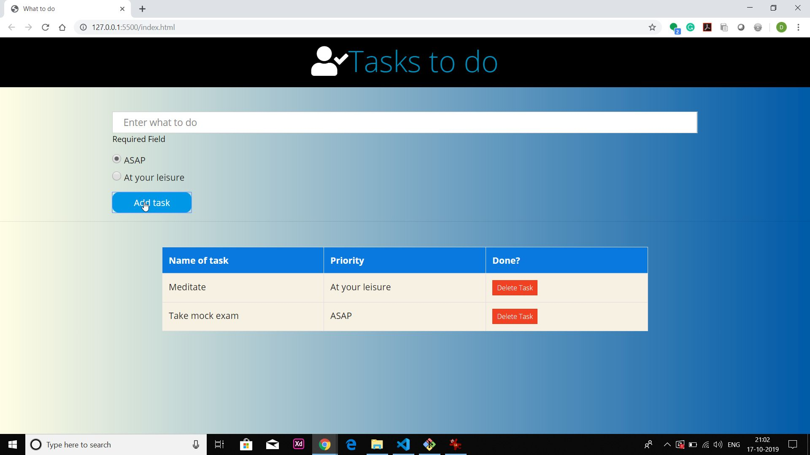

# To-Do-List
### Screenshots :
#### 1.First Look of application
</img>
_____
#### 2.Jogging task is to be added
</img>
_____
#### 3.Task added
</img>
_____
#### 4.Meditate task is to be added
</img>
_____
#### 5.Task added
</img>
_____
#### 6.Clicked on delete task to remove task jogging
</img>
_____
#### 7.Task removed
</img>
_____
#### 8.If empty input is submitted then gives alert required field
</img>
